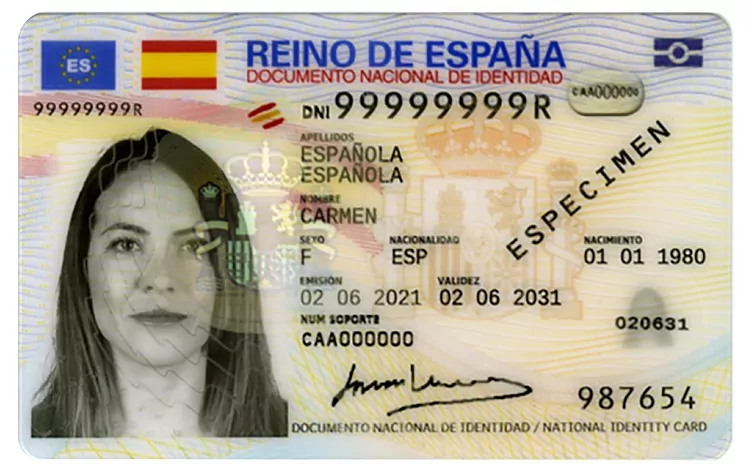

# Spanish DNI Calculator



The **Spanish DNI Calculator** is a simple tool that checks if the last letter of a Spanish NIE (Número de Identificación de Extranjero) is a valid checksum character, helping you verify the authenticity of a Spanish identification number.

## Table of Contents

- [Introduction](#spanish-dni-calculator)
- [Installation](#installation)
- [Usage](#usage)
- [Contributing](#contributing)
- [License](#license)

## Installation

To use the DNI Calculator, follow these steps:

1. Clone this repository to your local machine.

   ```bash
   git clone https://github.com/yourusername/dni_calculator.git
   ```

## Usage

Once the program is running, follow these instructions to validate a Spanish NIE:

1. Enter the full NIE when prompted. You can also use the foreign NIE format.
2. The program will calculate the checksum letter and display if it is correct or not.

Here's an example of how to use the program:

  ```plaintext
  To validate the NIE, enter below the full NIE:
  [You can also use the foreign NIE]

  12345678Z

  This nie: {12345678Z} is valid!
  ```

## Contributing

Contributions are welcome! Feel free to submit a pull request if you have any ideas for improvements, bug fixes, or new features.

1. Fork the repository.
2. Create a new branch for your feature or fix.
3. Make your changes and commit them.
4. Push your branch to your fork.
5. Submit a pull request.

## License

This project is licensed under the MIT License. See the [LICENSE](https://github.com/Supersonic2510/dni_calculator/blob/master/LICENSE.md) file for details.

